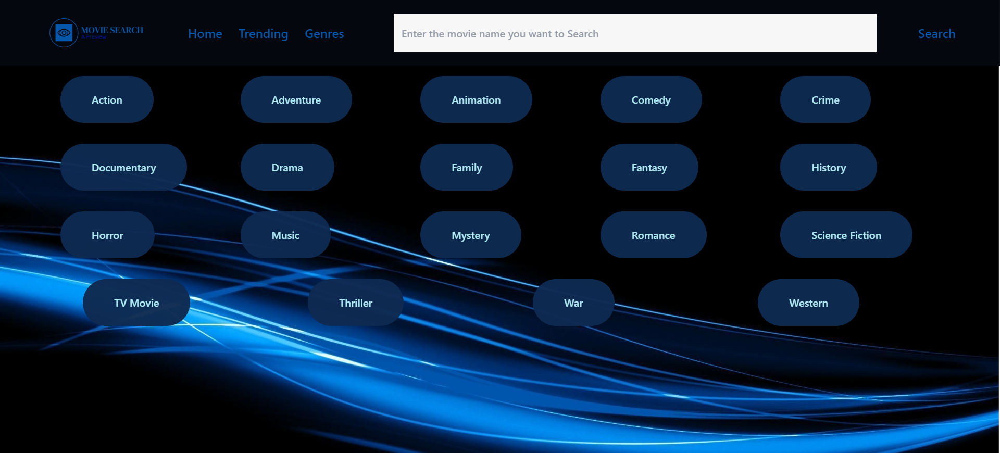

# Description
A suggestion App which allows you to watch trailers of movies based on a selected genre. The App uses TMDB API, Tailwind CSS, TypeScript. The Folder Structure is basic. The trailer opens up in a new tab  

# Deployed Version

[Live Link](https://movie-app-akj.netlify.app/)

## SnapShot of Project
# - HomePage

# - Trending Page

# - GenreSelection Page

# - Fantasy Genre 

# - Movie Page

## Available Scripts

You will have to add your key to the .env.local file and run the project for it to work.
In the project directory, you can run:

### `npm start` 
to start the app

### `npm run-script build`

Builds the app for production to the `build` folder.\
It correctly bundles React in production mode and optimizes the build for the best performance.

